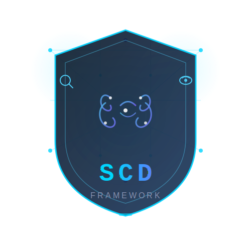
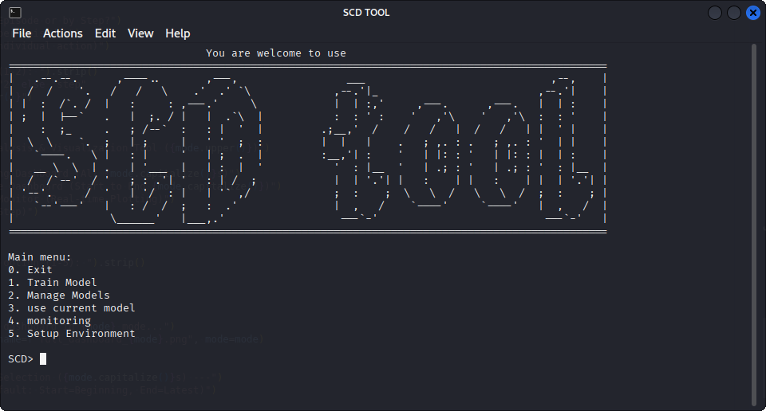

# SCD Framework

## وصف المشروع

إطار عمل تدريب وتقييم آلي في الأمن السيبراني باستخدام التعلم المعزز (Reinforcement Learning) لتنفيذ وتحليل عمليات المسح والاستطلاع والاستغلال.



## جدول المحتويات

- [نبذة عن المشروع](#نبذة-عن-المشروع)
- [الميزات الرئيسية](#الميزات-الرئيسية)
- [لقطات الشاشة ](#لقطات-الشاشة)
- [التقنيات والأدوات المستخدمة](#التقنيات-والأدوات-المستخدمة)
- [المتطلبات الأساسية](#المتطلبات-الأساسية)
- [خطوات التثبيت والتشغيل](#خطوات-التثبيت-والتشغيل)
- [طريقة الاستخدام](#طريقة-الاستخدام)
- [هيكلة المجلدات](#هيكلة-المجلدات)
- [المساهمة](#المساهمة)
- [الترخيص](#الترخيص)
- [معلومات التواصل](#معلومات-التواصل)

## نبذة عن المشروع

مشروع "SCD Framework" هو إطار عمل Python مفتوح المصدر مخصص لتطوير نماذج تعلم معزز في مجال الأمن السيبراني. يهدف المشروع إلى تمكين الباحثين والمطورين من تدريب واختبار أنظمة برمجية تقوم بأتمتة:

- عمليات المسح الشبكي (Scan)
- الاستطلاع وجمع المعلومات (Recon)
- استغلال الثغرات والتطبيقات الويب (Exploit)

يعمل المشروع على توفير بيئات RL مخصصة لكل نطاق مع مسارات تدريب، مراقبة حيّة، وتقييم نماذج مستندة إلى DDQN.

## الميزات الرئيسية

- ✅ واجهة تفاعلية رئيسية عبر `main.py`
- ✅ وحدات مستقلة لكل من `scan/`, `recon/`, `exploit/`
- ✅ تدريب نماذج DDQN للوكلاء في بيئات سيبرانية
- ✅ أدوات تقييم ومراقبة حية لحالة التدريب
- ✅ سيناريوهات تنفيذ هجومي قابلة للتشغيل بعد التدريب
- ✅ دعم تكوين مخصص لكل مجال عبر ملفات `config/env_config.py`
- ✅ يمكن استخدام `ping`,`nmap`,`ifconfig` داخل الاداة واومر اخرى نفذ help لمعرفة كل الاوامر

## لقطات الشاشة

- main



<!-- > 📌 لقطات الشاشة داخل مجلد `docs/` -->

## التقنيات والأدوات المستخدمة

- لغة البرمجة: Python 3.12.11
- مكتبات أساسية:
  - `tensorflow`
  - `numpy`
  - `pandas`
  - `matplotlib`
  - `seaborn`
  - `scapy`
  - `google-auth` و `google-api-python-client`
  - `requests`
- منصات وأدوات:
  - بيئة تدريب برمجية مخصصة عبر ملفات `train_main.py`
  - أنظمة مراقبة وعرض نتائج التدريب
  - إدارة التكوين عبر ملفات `env_config.py`

## المتطلبات الأساسية

- نظام تشغيل: Linux
- Python 3.12.11
- صلاحيات `sudo` أو root لتشغيل بعض وظائف الشبكة
- تنصيب الحزم من `requirements.txt`  او شغل الاداة `python3 main.py` واختار الخيار 5

## خطوات التثبيت والتشغيل

1. انسخ المشروع إلى جهازك او حملة من github.
```bash
git clone https://github.com/scdgroup/SCD_FRAMEWORK.git
```

2. انتقل إلى مجلد المشروع:

```bash
cd SCD_FRAMEWORK
```

3. ثبت المتطلبات:


```bash
# python main.py and choice 5 
# OR python3 -m pip install -r requirements.txt
# OR use sudo bash setup.sh
```


4. شغّل سكربت الإعداد:

```bash
sudo bash setup.sh
```

5. شغّل الواجهة الرئيسية:

```bash
sudo python3 main.py
```

## طريقة الاستخدام

### تشغيل القائمة الرئيسية

```bash
sudo python3 main.py
```

ثم اختر من القائمة:

- `1` لتدريب نماذج `scan`, `recon`, أو `exploit`
- `2` لاختبار النموذج الحالي
- `3` لتنفيذ الهجوم باستخدام نموذج مدرب
- `4` للدخول إلى أدوات المراقبة
- `5` لتشغيل الإعداد لتثبيت الاداة ضروري لتعمل بسلاسة
- `0` للخروج


### مثال: تشغيل هجوم Scan

```bash
cd scan
python3 universal_scan.py 
```

### مثال: تشغيل هجوم Recon

```bash
cd recon
python3 universal_recon.py 
```

### مثال: تشغيل هجوم Exploit

```bash
cd exploit
python3 universal_exploit.py 
```
### سيتم انشاء تقرير بناء على تنفيذ الهجمات وفتحه في المتصفح

### امثلة للتدريب الجديد 

1. Exploit:

```bash
cd exploit
python3 train_exploit.py 
```
2. Recon:

```bash
cd recon
python3 train_recon.py 
```

3. Scan:

```bash
cd scan
python3 train_scan.py 
```

## هيكلة المجلدات

- `main.py` - نقطة الدخول الرئيسية للتطبيق
- `requirements.txt` - تبعيات Python
- `setup.sh` - سكربت إعداد وتثبيت
- `scdtool.sh` - سكربت تشغيل المشروع بعد التثبيت
- `core/` - وظائف مشتركة، إدارة القوائم، المراقبة، والتكوين العام
- `scan/` - وحدة المسح الشبكي مع بيئة RL، تدريب، تقييم، وتشغيل الهجوم
- `recon/` - وحدة الاستطلاع، بيئة RL، تدريب، تقييم، وتشغيل الهجوم
- `exploit/` - وحدة الاستغلال، بيئة RL، تدريب، تقييم، وتشغيل الهجوم
- `doc/` - ملفات وثائقية إضافية

## المساهمة

إذا كنت تريد المساهمة في المشروع، فاتبع الخطوات التالية:

1. أنشئ فرعاً جديداً من `main` أو `master`.
2. أضف التعديلات اللازمة أو الميزات الجديدة.
3. اختبر الوظائف محلياً.
4. افتح طلب سحب (Pull Request) مع شرح للتغييرات.

> ⚠️ تأكد من أن التعديلات لا تؤثر على بنية الملفات الأساسية وأدوات التدريب.

## الترخيص

- الترخيص غير محدد حالياً.

## معلومات التواصل

- Email: `scdgroup.01@gmail.com` 
